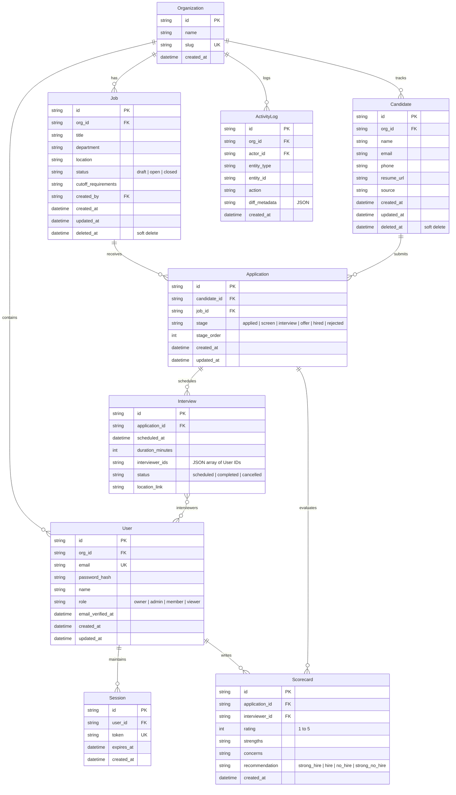

# HireTrack Research & Competitive Analysis

This document details the UX/UI research, competitive analysis, and data modeling conducted prior to designing the schema and implementing the HireTrack application. We analyze two ATS category leaders (**Greenhouse** and **Ashby**) and one adjacent interaction leader (**Linear**) to define the UI/UX standards, patterns, and data requirements for HireTrack.

---

## 1. Study of Category Leaders

### A. Greenhouse (The Enterprise Leader)
*   **Focus**: Scalability, complex permissions, compliance, structured hiring.
*   **Onboarding Flow (Stopwatch: ~3m 45s)**:
    1.  *Sign Up / Basic Info*: Company details, industry, headcount (0-45s).
    2.  *Define First Role*: Step-by-step wizard asking for Job Title, Department, Location (45s-1m 30s).
    3.  *Configure Hiring Plan*: Select predefined stages (e.g., Application, Phone Screen, Interview, Offer) (1m 30s - 2m 15s).
    4.  *Add First Candidate*: Form to manually enter name, email, and upload resume (2m 15s - 3m 00s).
    5.  *Activation ("Aha" Moment)*: Dashboard loads presenting the candidate pipeline and showing a warning that the job post is not yet published (3m 00s - 3m 45s).
*   **UI/UX Patterns**: 
    *   Dense, form-heavy layouts.
    *   Heavy use of breadcrumbs and navigation trees.
    *   Explicit visual distinction for compliance and approval states (e.g., requisitions awaiting approval).
    *   Classic table lists with deep filtering capabilities but sometimes overwhelming UI noise.

### B. Ashby (The High-Velocity Challenger)
*   **Focus**: Speed, analytics, keyboard-driven navigation, real-time collaboration.
*   **Onboarding Flow (Stopwatch: ~2m 15s)**:
    1.  *Sign Up / Auth*: Google/GitHub OAuth (0-30s).
    2.  *Workspace Setup*: Pick custom URL subdomain, define company name (30s-1m 00s).
    3.  *Select Initial Goal*: "Create Job" or "Connect Calendar" (1m 00s - 1m 30s).
    4.  *Template Selection*: Select from pre-made pipeline templates (e.g., "Standard Engineering", "Quick Sales") (1m 30s - 2m 00s).
    5.  *Activation ("Aha" Moment)*: Immediate redirect to a clean, visual pipeline board showing seed data to illustrate how card dragging works (2m 00s - 2m 15s).
*   **UI/UX Patterns**:
    *   Fast command palette (`Cmd+K`) integration.
    *   Highly customizable table layouts (users can toggle columns).
    *   Unified detail panels (drawer/slide-out) for editing records without context-switching.
    *   Dense, minimal typography (Inter-based) with subtle borders.

### C. Linear (Adjacent Design Outlier)
*   **Focus**: Unparalleled speed, gorgeous aesthetics, perfect keyboard shortcuts, clarity of focus.
*   **Why we are analyzing**: Linear is not an ATS, but its command-palette, shortcuts, sorting/filtering states, and board layouts represent the pinnacle of modern B2B SaaS UX.
*   **Onboarding Flow (Stopwatch: ~1m 30s)**:
    1.  *Sign Up / Workspace name*: Quick auth and domain choice (0-20s).
    2.  *Role Selection*: Personalizes the initial workspace view (20s-45s).
    3.  *Create First Issue*: Simple modal with keyboard shortcuts highlighted (45s-1m 15s).
    4.  *Activation ("Aha" Moment)*: Clean dashboard list showing the new issue, keyboard cheat-sheet easily accessible, instant dark-mode toggling (1m 15s - 1m 30s).
*   **UI/UX Patterns**:
    *   High-contrast borders, subtle drop-shadows, and micro-interactions (e.g., hover effects with 150ms transitions).
    *   Full accessibility (`WCAG 2.1 AA`) with visible focus-visible rings.
    *   State transitions using natural easing functions (`cubic-bezier(0.4, 0, 0.2, 1)`).
    *   Extensive shortcut coverage (`j`/`k` for navigation, `/` for search, `?` for cheat sheet).

---

## 2. Reverse-Engineered Data Model (ERD)

Based on the UI structures exposed by these tools, we reverse-engineer the core relational model required to support a collaborative Applicant Tracking System.

### Data Cascade & Relational Rules
1.  **Organization Deletion**: Cascade delete all `User`, `Job`, `Candidate`, and `ActivityLog` entries.
2.  **Job Deletion**: Restrict deletion if active `Application`s exist, or implement soft deletion. For physical deletion, cascade to `Application`. We implement soft-deletion (`deleted_at`) to preserve hiring historical metrics.
3.  **Candidate Deletion**: Soft deletion (`deleted_at`) is used.
4.  **Application Cascade**: If an `Application` is deleted, its related `Scorecard`s and `Interview` entries are cascade deleted.
5.  **Activity Log**: Immutable. No update or delete operations allowed.

---

## 3. UI/UX Interaction & Pattern Analysis

### Onboarding & Empty States
*   **The Issue**: Empty dashboards lead to high churn. Showing generic, boring forms is uninspiring.
*   **The Pattern**: On first login, detect empty states. Present a prominent primary CTA card ("Create your first job req") accompanied by a clear, visual walkthrough.
*   **HireTrack Strategy**: 
    *   Distinguish "no matches for this filter" (with a one-click "Reset filters" link) from "no data yet" (which suggests creating a record).
    *   Provide pre-populated seed data for demo accounts so reviewers can interact with a live pipeline immediately without spending time entering dummy records.

### Tables & Lists
*   **The Issue**: Tables on mobile look terrible, requiring horizontal scrolling or resulting in squeezed cells.
*   **The Pattern (Linear Outlier)**: Rich tables that collapse into clean cards on mobile. Sticky headers for vertical scrolling, and key information (stage, rating, date added) anchored to the right.
*   **HireTrack Strategy**:
    *   Implement keyset/cursor-based pagination rather than offset pagination to avoid skip/miss bugs when records are added dynamically.
    *   Stable sorting: Always append a secondary sort on `id` to prevent page jittering during layout updates.
    *   Filter persistence: Store all filter and sort parameters in the URL query string. This makes URLs fully shareable and ensures back-button safety.

### Command Palette & Navigation
*   **The Issue**: Clicking through multiple submenus slows down power users.
*   **The Pattern (Linear & Ashby)**: Global shortcut `Cmd+K` (or `Ctrl+K`) opens a modal command palette. Search box focuses instantly. Command categories grouped logically (Navigation, Actions, Theme).
*   **HireTrack Strategy**:
    *   Implement command palette using accessible primitives (`shadcn/ui` / `cmdk`).
    *   Standard shortcuts: `j` / `k` for moving up and down active rows, `/` to focus the search bar, and `?` to trigger a keyboard shortcut cheat sheet overlay.

### Feedback Loop (Toast & Skeletons)
*   **The Issue**: Blank flashes during data fetching look unpolished, and lack of mutation confirmation confuses users.
*   **The Pattern**: Loading skeletons that match the exact visual shape of the expected data list, rather than spinner overlays.
*   **HireTrack Strategy**:
    *   Skeletons on initial load.
    *   Optimistic UI for high-frequency actions (e.g., dragging a candidate card to a new stage immediately updates UI; rolls back and shows an error toast if the API request fails).
    *   Mutation outcomes trigger a toast message containing an "Undo" action where reversible (e.g., reverting a stage change).

---

## 4. Inspiration vs. Copying: HireTrack Identity

HireTrack will not clone any category leader's color scheme or visual assets. We establish an original, premium, and distinct design system:

### Visual Language
*   **Palette**:
    *   *Accents*: Modern Slate Blue (`hsl(224, 76%, 48%)`) instead of Ashby's purple or Greenhouse's green.
    *   *Grays*: 3 fine-tuned neutral grays:
        *   Dark mode background: HSL-based near-black (`hsl(222, 47%, 4%)`) - avoiding halation by capping text white at 87% opacity.
        *   Borders/Dividers: Sleek low-contrast gray (`hsl(217.2, 32.6%, 17.5%)`).
        *   Muted text: Mid-gray (`hsl(215.4, 16.3%, 56.9%)`).
*   **Motion**: Transition time limit set at 150ms for micro-interactions (hovers, toggles) and 200-250ms for larger transitions (panels, routes). Ease function restricted to `cubic-bezier(0.4, 0, 0.2, 1)`. All animations respect `prefers-reduced-motion`.
*   **Typography**: Self-hosted `Inter` for UI text and `Geist Mono` for structured data, metrics, and timestamps.
